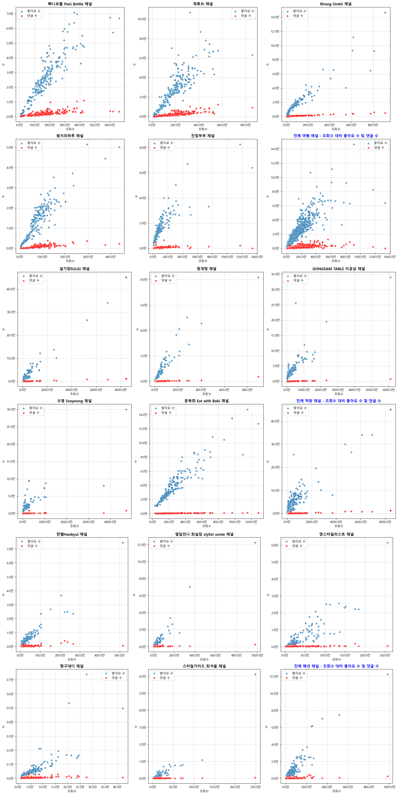

# YouTube Channel Analysis Project

Descriptive statistical analysis of how video performance on Korean YouTube varies with upload timing, upload cadence, video duration, and engagement — across 15 channels in Fashion, Mukbang, and Travel.

*Python · pandas · SciPy · Matplotlib/Seaborn · YouTube Data API v3 · 15 channels, 2,125 videos.*

## Results at a Glance

- **2,125 videos / 15 channels / 3 categories**: 5 Korean channels in each of Fashion, Mukbang, and Travel, up to 200 recent videos collected per channel. 2,125 is the number of videos left in the upload-cadence analysis, per channel, after keeping upload gaps of 1–30 days and removing view outliers (1.5×IQR).
- **Daily uploading was optimal for only 3 of 15 channels.** The upload interval with the highest average views is channel-specific, ranging from 1 day up to 8–14 days — there is no universal "best cadence" in this sample.
- **For 10 of 15 channels, one upload interval had the highest average for both views and likes**; for the other 5, the best interval for likes differs from the one for views.
- **Likes rise with views in all 18 per-channel and per-category scatter panels.** Comments are about an order of magnitude smaller and share the same axis, so the figure cannot rank the two by correlation strength; no real-data correlation coefficient was computed.
- **Channel age shows no visible link to channel size** in this sample of 15 channels: older channels do not necessarily have more subscribers or total views (scatterplot only, no statistical test).
- **These are descriptive comparisons**, not tested effects: there is no baseline model and no significance test, and an upload-interval bucket counts with as few as 2 videos.



*Views vs likes (blue) and views vs comments (red) for each channel and category aggregate — one of 8 checked-in result visualizations from the real-data run.*

## Quick Start

Clone the repository:

```bash
git clone https://github.com/CY-HYUN/Youtube-Channel-Analysis-Project.git
cd Youtube-Channel-Analysis-Project
```

Install dependencies:

```bash
# Python 3.9-3.11 (the pinned original environment):
pip install -r requirements.txt

# Python 3.12+ (the pins predate 3.12 — install current versions instead):
pip install pandas numpy scipy matplotlib seaborn wordcloud
```

Run:

```bash
# Smoke test — loads and preprocesses data, prints a summary
python analysis/data_preprocessing.py
# expected output:
#   Using sample data for demonstration...
#   Total records: 3000
#   Categories: ['Gaming' 'Food' 'KPOP' 'Kids' 'Science' 'Variety']
#   Columns: ['카테고리', '채널명', '제목', '조회수', ...]

# Run one full analysis end-to-end, headless (saves PNGs into visualizations/)
MPLBACKEND=Agg python analysis/02_upload_timing_analysis.py
```

Analyses 02, 03, 04, 06, 07, and 08 run end-to-end on the built-in sample data the same
way (verified). Analysis 01 additionally requires the `wordcloud` package, and analysis 05
needs a per-video duration column (`재생 시간(분)`) that only the real dataset provides —
it errors out on the sample data. Without `MPLBACKEND=Agg`, each script opens interactive
plot windows (`plt.show()`).

> **Data note:** The original dataset — three CSVs of channel and video metadata collected
> via the YouTube Data API v3 — is private and not included in this repo (`*.csv` is
> gitignored). When no data is present, the scripts fall back to a **built-in synthetic
> sample generator** (3,000 rows, fixed seed), so a fresh-clone run demonstrates the
> pipeline but does not reproduce the findings above. All reported numbers come from the
> original-data run preserved in `notebooks/Youtube_Channel_Anaylsis_Project.ipynb`
> (outputs checked in) and the result PNGs in `visualizations/`. The `load_from_youtube_api()`
> helper is a stub — re-collecting the dataset requires implementing it with your own API key.

## Repository Structure

```text
Youtube Channel Analysis Project/
├── analysis/                           # Modular pipeline: 8 standalone analyses + shared preprocessing
│   ├── data_preprocessing.py           # Shared module: loading, sample generator, cleaning, Korean fonts
│   ├── 01_wordcloud_analysis.py        # Title keywords per category (requires wordcloud)
│   ├── 02_upload_timing_analysis.py    # Average views by upload day-of-week / hour-of-day
│   ├── 03_upload_frequency_analysis.py # Views and likes vs days-between-uploads
│   ├── 04_correlation_analysis.py      # Pearson correlation: views-likes, views-comments
│   ├── 05_video_duration_analysis.py   # Top-10 vs bottom-10 videos by duration
│   ├── 06_channel_age_analysis.py      # Channel age vs subscribers and total views
│   ├── 07_expected_views_analysis.py   # Actual vs expected views per channel
│   └── 08_subscriber_ratio_analysis.py # Views-per-subscriber efficiency
├── notebooks/                          # Original bilingual (KR/EN) notebook run on the real dataset
├── visualizations/                     # Checked-in result PNGs from the real-data run (one folder per analysis)
├── requirements.txt                    # Pinned original environment (Python 3.9-3.11)
└── README.md
```

Two layers cover the same eight questions:

- **`notebooks/`** — the original analysis, executed against the real CSVs; its cell outputs
  (per-channel results, tables, figures) are preserved in the notebook and exported to
  `visualizations/`. Every finding below comes from this layer.
- **`analysis/`** — the eight analyses refactored into standalone, importable scripts
  sharing one preprocessing module, runnable on any dataset with the expected schema
  (falls back to the sample generator otherwise). The scripts differ from the notebook
  in places: they add 99th-percentile trims (analyses 05, 06, 07), quartile bands
  (analysis 07) and Pearson coefficients (analysis 04), and they take one subscriber
  value per channel in analysis 08. Their output on the real data was never recorded.

DataFrame columns are Korean, matching the source data: `카테고리` (category), `채널명`
(channel), `제목` (title), `조회수` (views), `좋아요 수` (likes), `댓글 수` (comments),
`구독자수` (subscribers), `게시일` (upload date).

## The 8 Analyses

| # | Analysis | Question | Result figure |
| --- | --- | --- | --- |
| 1 | Word cloud | Which title keywords do top channels in each category use? | [PNG](visualizations/01_wordcloud/wordcloud_analysis.png) |
| 2 | Upload timing | Which upload day/hour gets the highest average views? | [PNG](visualizations/02_timing_analysis/upload_timing.png) |
| 3 | Upload frequency | Which interval between uploads maximizes views and likes? | [PNG](visualizations/03_upload_frequency/upload_frequency.png) |
| 4 | Correlation | How tightly do likes and comments track views? | [PNG](visualizations/04_correlation/correlation_analysis.png) |
| 5 | Video duration | Do longer videos get fewer views? | [PNG](visualizations/05_duration/video_duration.png) |
| 6 | Channel age | Do older channels have more subscribers/views? | [PNG](visualizations/06_channel_age/channel_age.png) |
| 7 | Expected views | Which videos beat their channel's expected view count? | [PNG](visualizations/07_expected_views/expected_views.png) |
| 8 | Subscriber ratio | Which channels get the most views per subscriber? | [PNG](visualizations/08_subscriber_ratio/subscriber_ratio.png) |

## Key Findings

**Upload cadence is channel-specific, not universal.** Per-channel optimum intervals
(after IQR outlier removal on views) ranged from 1 day to 8–14 days. Only 3 of 15
channels performed best with daily uploads; several top travel and mukbang channels
peaked at 8–14 day intervals. The full per-channel table is in
[docs/DETAILS.md](docs/DETAILS.md).

**Likes rise with views in every panel.** In all 18 scatter panels (15 channels + 3
category aggregates), likes rise almost linearly with views. Comments look flat, but they
are about ten times smaller and are drawn on the same axis, so the figure does not show
that comments correlate less with views. Measuring that needs the per-signal correlation
(`analysis/04_correlation_analysis.py`), which was not run on the real data.

**Channel age shows no visible link to scale.** Plotting creation dates against total
subscribers and views for the 15 channels shows older channels do not systematically
dominate. With 15 points and no test, this is an observation about these channels, not a
general result.

**Most videos fall below their channel's average.** Comparing each video against its
channel baseline (total views ÷ total videos, and a recent-200-videos baseline), most
videos in every category miss the expected view count. Part of this is built into the
baseline: views are right-skewed, so a mean pulled up by a few hits sits above most
videos. A median baseline would separate real under-performance from that effect; it was
not computed.

**Subscriber ratio: no finding reported.** In the real-data run, the Mukbang and Travel
panels sum the subscriber count over every video row (`'sum'` in the notebook's
subscriber-ratio cells) instead of taking one value per channel; only the second Fashion
pass uses `'max'`. The ratios for those two categories are therefore not per-channel
views-per-subscriber, and no cross-channel conclusion is drawn from them.

## Methodology Summary

- **Collection:** YouTube Data API v3; the 5 top channels per category; up to 200 recent
  videos per channel; video metadata (views, likes, comments, duration, upload datetime)
  plus channel metadata (subscribers, creation date, total views).
- **Preprocessing:** comma-formatted numbers coerced to integers, upload datetimes parsed
  with day-of-week / hour extraction, rows with unparseable dates dropped. Shorts are
  removed only in the duration analysis (> 60 s) and the expected-views analysis (≥ 70 s).
  The shared preprocessing cell also tries to drop Shorts, but it looks for a column name
  the data does not have and prints a warning instead, so the timing, cadence and
  correlation analyses include Shorts.
- **Outlier handling:** 1.5×IQR filter on views, per channel, for the cadence analysis.
  The scripts add 99th-percentile trims in the duration, channel-age, and expected-views
  analyses; the notebook run did not use them.
- **Statistics:** groupby aggregations, day×hour pivot heatmaps, scatterplots, and
  mean-based expected-view baselines. No significance tests.
- **Visualization:** matplotlib + seaborn with Korean font handling (Malgun Gothic);
  bilingual Korean/English labels.

Full per-analysis methodology and the per-channel results table:
[docs/DETAILS.md](docs/DETAILS.md).

## Limitations

- The sample is 15 top channels in 3 categories — findings describe these channels, not
  all of YouTube.
- The real-data correlation results are preserved as scatterplots; numeric Pearson
  coefficients are computed by `analysis/04_correlation_analysis.py` only when a dataset
  is supplied (the original notebook run did not print them).
- `load_from_youtube_api()` is a stub; data re-collection is not turnkey.
- No baseline or significance test: "best interval" means the bucket with the highest
  average, and a bucket needs only 2 videos to count. The cadence results are
  descriptive.
- The notebook cells were run out of order (execution counts are not sequential), and
  the shared Shorts filter did not fire (see Methodology), so Shorts are inside the 2,125
  cadence videos.
- The subscriber-ratio cells for Mukbang and Travel sum subscribers over video rows
  (see Key Findings); the script version (`analysis/08_subscriber_ratio_analysis.py`)
  takes one value per channel but has not been run on the real data.
- The 5 channels per category were chosen before this analysis; the selection rule is
  not recorded in the repository.

## Tech Stack

Python · pandas · NumPy · SciPy · Matplotlib · Seaborn · WordCloud · Jupyter ·
google-api-python-client (YouTube Data API v3)

## License

MIT — see [LICENSE](LICENSE).
